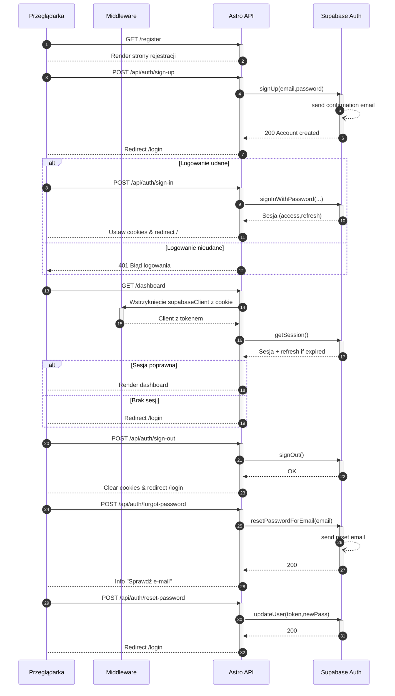

<authentication_analysis>

1. Wymienione przepływy autentykacji:
   - Rejestracja konta (sign-up)
   - Logowanie hasłem (sign-in)
   - Odzyskiwanie hasła (forgot-password)
   - Reset hasła z tokenem (reset-password)
   - Wylogowanie (sign-out)
   - Ochrona zasobów (SSR guard przed dostępem do chronionych stron)
2. Główni aktorzy i interakcje:
   - Przeglądarka (Browser)
   - Middleware (autoryzacja cookie i sesji)
   - Astro API (endpointy auth)
   - Supabase Auth (usługa uwierzytelniania)
3. Procesy weryfikacji i odświeżania tokenów:
   - getSession() z `@supabase/ssr/astro` w SSR
   - Automatyczne odświeżanie tokenu dostępowego przy wygasłej sesji przez Supabase
4. Opis kroków:
   a) Przeglądanie stron zalogowanych/niezalogowanych
   b) Wywołanie endpointu auth w Astro API
   c) Komunikacja z SupabaseAuth do signUp/signIn/reset
   d) Ustawianie/usuwanie ciastek sesyjnych
   e) Przekierowania na odpowiednie strony
   </authentication_analysis>

<mermaid_diagram>

</mermaid_diagram>

https://www.mermaidchart.com/raw/a77665c8-4d15-429f-ae6d-ea4d0bfcd7d6?theme=light&version=v0.1&format=svg
